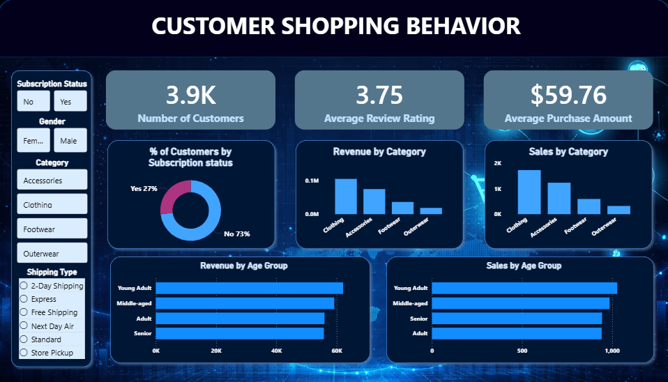

# 🛍️ Customer Shopping Behavior Analysis

---

## 📌 Project Overview
This project analyzes customer shopping behavior using transactional retail data to uncover patterns, trends, and insights that support data-driven business decisions.

### 🎯 Objective
To identify customer purchasing trends and provide actionable recommendations to improve:
- Customer engagement  
- Marketing strategies  
- Product performance  

---

## 📊 Dataset Summary

| Feature Type          | Description |
|----------------------|------------|
| Records              | 3,900 purchases |
| Columns              | 18 features |
| Demographics         | Age, Gender, Location, Subscription |
| Purchase Details     | Product, Category, Price, Season |
| Behavioral Data      | Discounts, Ratings, Frequency |

⚠️ Missing values in **Review Rating** were handled during preprocessing.

---

## 🧹 Data Preparation (Python)

- Data loading using `pandas`
- Exploratory Data Analysis (EDA)
- Missing value handling (median imputation)
- Data cleaning and formatting
- Feature engineering:
  - `age_group`
  - `purchase_frequency_days`
- Removed redundant data
- Stored cleaned data in PostgreSQL

---

## 🗄️ Data Analysis (SQL)

### 🔍 Key Insights Extracted:
- 💰 Revenue comparison by gender  
- 🛒 High-spending customers using discounts  
- ⭐ Top-rated products  
- 🚚 Shipping type impact on spending  
- 👥 Subscribers vs non-subscribers  
- 🎯 Customer segmentation (New / Returning / Loyal)  
- 📦 Top products per category  
- 🔁 Repeat purchase behavior  
- 📈 Revenue by age group  

---

## 📈 Power BI Dashboard

### 📌 Features
- Interactive filters (Age, Gender, Category, Subscription)
- KPI cards for revenue and customer insights
- Visualizations:
  - Bar charts  
  - Pie charts  
  - Line graphs

## 📷 Dashboard Preview

---

## 💡 Business Recommendations

- 🎁 Improve subscription programs with exclusive offers  
- 🏆 Introduce loyalty rewards for repeat customers  
- 💸 Optimize discount strategies  
- 📢 Promote top-performing products  
- 🎯 Use targeted marketing campaigns  

---

## 🛠️ Tech Stack

| Technology   | Usage |
|-------------|------|
| Python       | Data preprocessing & analysis |
| PostgreSQL   | Data querying |
| Power BI     | Visualization |

---

    

